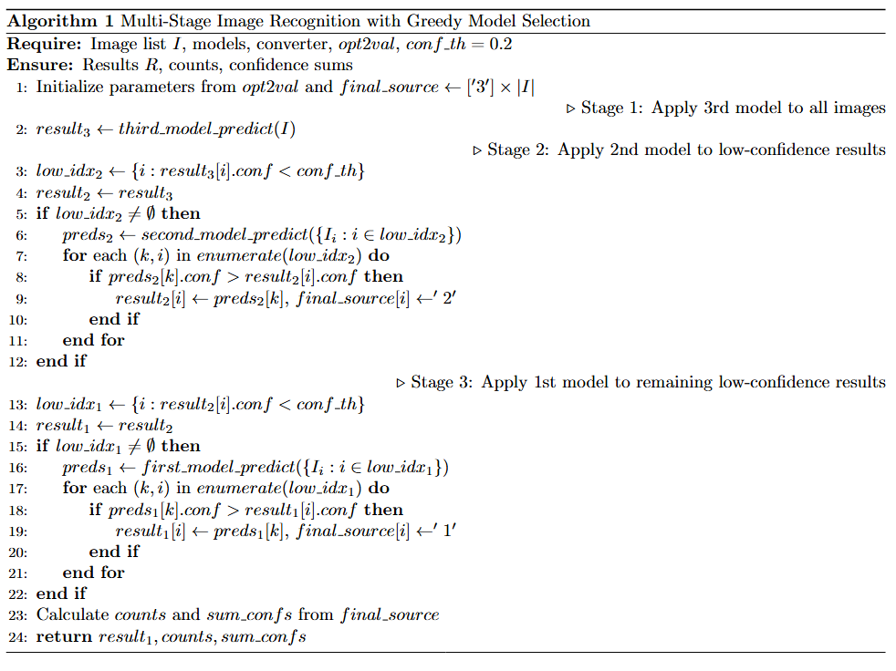
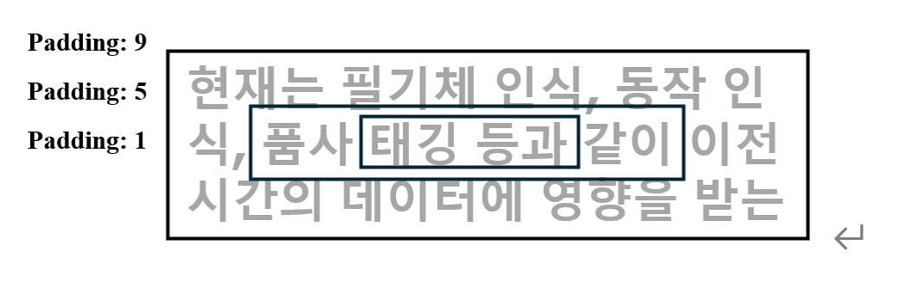

# Efficient OCR for Information Digitalization

> This codebase is based on KaKaoBrain OCR Platform. Created as a part of SungKyunKwan University Project for Lightweight OCR.

<div align="center">
  <table>
    <tr>
      <td align="center">
        <br/>
        Hierarchical Prediction Algorithm
      </td>
      <td align="center">
        <br/>
        Label Extraction
      </td>
    </tr>
  </table>
</div>

## Requirements

```bash
pip install -r requirements2.txt 
```

## Usage
```bash
from pororo import Pororo

ocr = PororoOcr()
image_path = input("Enter image path: ")
text = ocr.run_ocr(image_path, debug=True)
print('Result :', text)
```
or test with
```bash
''' 
    ocr = PororoOcr()
    IMAGE_PATH = input("Enter image path: ")
    
    
    for filename in os.listdir(IMAGE_PATH):
''' 
python main.py
```

## Additional Contributions made by our team

### 1. Greedy Model Selection Algorithm
- **3-trial Hierachical Prediction** : Special Character -> Digit -> Base
- **Confidence based threshold**: Choose the best prediction by checking Confidence threshold
- **Rotated Character detection**: Try 𝝅/2, 𝝅, 3𝝅/2 rotation for all bounded boxes for detecting rotated characters.

### 2. Label extraction for korean characters using CLOVA-API(teacher)
- **Automated dataset generation pipeline**: Extract text regions and labels from raw images using CLOVA OCR API
- **Quality-aware filtering**: Validate crops based on size, aspect ratio, text length, and recognition confidence
- **Multi-stage enhancement**: Apply denoising, contrast adjustment, and sharpening to improve crop quality for training

## Project Structure
```
    SKKUOCR/
    ├── pororo/                         # Main OCR library
    │   ├── models/brainOCR/            # BrainOCR model implementation
    │   │   ├── brainocr.py             # Reader class
    │   │   ├── recognition.py          # Recognition model and prediction functions
    │   │   ├── detection.py            # CRAFT detection model
    │   │   ├── model.py                # Model architecture
    │   │   └── modules/                # Sub-modules
    │   └── tasks/                      # Task-specific factory classes
    │       └── optical_character_recognition.py
    ├── ocr_utils.py                    # OCR utility functions (bbox, enhancement, validation)
    ├── dataset.py             # Dataset generation pipeline with CLOVA API
    ├── main.py                         # Main OCR execution script
    └── utils/                          # Utility functions
        └── image_util.py               # Image processing utilities
```

## References
This research is based on the following technologies:
- **CRAFT**: Character Region Awareness for Text detection  
- **BrainOCR**: Korean OCR model from Pororo library  
- **CTC Loss**: Connectionist Temporal Classification for sequence learning  
- **CRNN**: Convolutional Recurrent Neural Network architecture  

## Contributors

- Je Hyun Park†  
- Chul Seok Kang†  
- Sang Hoon Han†
- Sung Hwan Jo†  
